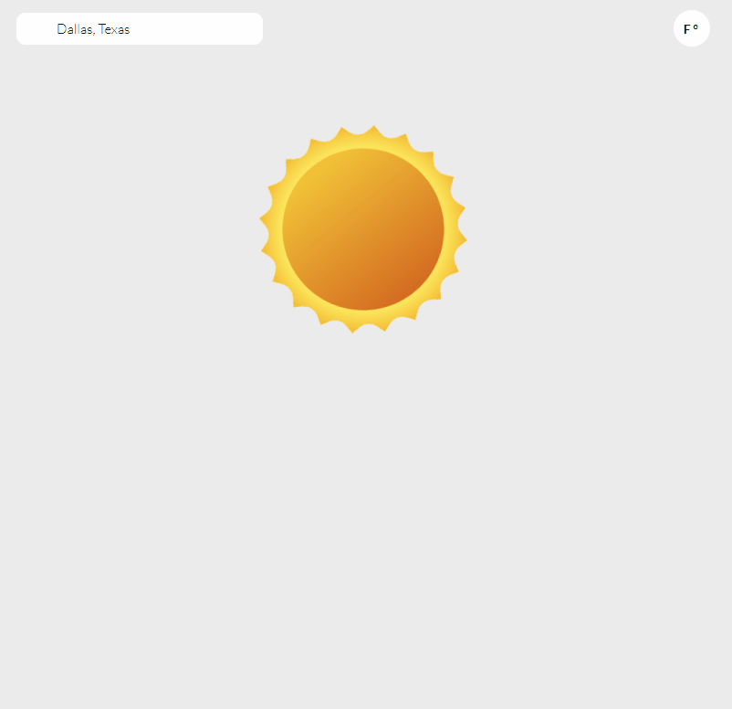

# Weather App Built with React, TanStack Query, and Styled Components.

<div align="center"></div>

The goal of the project is to create a working, web-based weather application that allows users to search for the current weather and the five-day forecast of a specific city around the world.

Three goals I aimed to achieve with this project include:

1. Use servless functions to act as a proxy between the application and API to ensure that no API keys are exposed through client.
2. Thoroughly test the application to ensure no errors are deployed.
3. Make the application accessible as possible, ensuring that those with disablities can easily search for the weather as well.

The application was previously built using basic react with no TypeScript. After improving my skills and working on multiple projects, I decided to revisit the project and improve upon it with the new skills and tools I have learned up to this point. You can find the original version of the project under the branch titled ["app-version-1"](https://github.com/JorgeAMendoza/react-weather-app/tree/app-version-1)

API used to retrieve weather provided by [OpenWeather](https://openweathermap.org/api), both versions of the application use the 2.0 version of the One Call API. **Version 2.0 of the the API can no longer be signed up for**.

Three improvements I wanted to focus on was:

1. Fetching and handling data more efficiently with state-management tools.
2. Component structure and project organization, I wanted to make it clear to people reading the code how the component worked and why it was structured like so.
3. Better use of the styled-components library.
4. Testing the application.

## Techstack Used

This Project was bootstrapped with [Vite](https://vitejs.dev/guide/) using the React/Typescript template. The project is linted with [Eslint](https://eslint.org/docs/latest/user-guide/getting-started) using react, prettier, cypress, and the [jsx-a11y](https://github.com/jsx-eslint/eslint-plugin-jsx-a11y) rules. Please see the `.eslintrc` file for all the linting rules used in this project.

The following are the main tools used to create the application:

- [React](https://reactjs.org/docs/getting-started.html), a JavaScript library for building user interfaces.
- [Tanstack Query](https://tanstack.com/query/v4/docs/react/overview), a state management tools for queries made in the application.
- [Cypress](https://docs.cypress.io/guides/overview/why-cypress#What-you-ll-learn), front end testing tool for writing unit and integration test.

Other libraries used include [axios](https://www.npmjs.com/package/axios) which is a HTTP client for the browser and node.js, and [react-hook-form](https://react-hook-form.com/get-started) which is state-management tool for building and managing form state.

## Running the application

Once the application has been cloned to your local machine, run `npm i` to install all dependencies.

The [Vercel CLI](https://vercel.com/docs/cli) is required to run the application locally.

Instead of using `npm run dev` to launch the application in vite, the application needs to also be running the vercel serverless function locally, you will need to run `vercel dev` which runs vite and the the API located at `api/weather`. Some notes about this process

1. On windows this must be run on the command line and not Git Bash.
2. An API key is needed in the .env file named `API_KEY`. A key for the **One Call Weather 2.0** is also required as well, which is sadly no longer avaliable for free.
3. A vercel account is required to pull the project setttings and run the `vercel dev` command.

Once launched, the application will be running on `localhost:3000`, with the API runing on the same host.

## Improving upon the application

The project originally started when I was taking an online course provided by [The Odin Project](https://www.theodinproject.com/lessons/node-path-javascript-weather-app), where I was tasked to create a weather application using an API. At the time I was just getting into React, so I decided it would be a great opportunity to build a functional React application for the first time

The original version of the application was bootstrapped with [create-react-app](https://create-react-app.dev/) with styled-components used to style the application as well. This was also my first time using styled components to style a project like this.

A year later, when I revisited the project, I found that there are multiple improvements that can be made within the project. One of the biggest changes was switching over to Vite from Create-React-App. This was done since I found Vite much easier and efficient to use and easier to configure.

This section will review some of the main changes I made to the application and why they were made.

### Fetching Weather Data

I orginally structured the application so that one API call would be made and the results would be passed down to the various components that needed to display data. I attempted to create a presentional/container component structure. So `App.js` would be in charge of holidng multiple instances of state and calling a function that retrives weather data and set the values of multiple states. This data would then be passed down to components to be displayed.

Some issues I have wite this approach include:

1. **Too many instances of state**, there are multiple instances of state that are not needed. For example, the `searchLocation` state is only used to display the location of the weather data, but the data is already stored in the `currentWeather` state. The `searchQuery` state is only used to make the API call, but the data is already stored in the `currentWeather` state.
2. **Weather data fetch lives in component**, on every re-render we are creating the function again, the function should be able to live outside the component, taking in a search query and returning the data needed.
3. **Error handling**, there is no direct error handling, errors are caught with `.catch()` but all it does is set a message.
4. **Exposed API**, in the orginal verion of the application the API key was being exposed with every request because the key is was part of the query.

Original `App.tsx` logic for retrieving and setting weather data:

```typescript
function App() {
  const [searchQuery, setSearchQuery] = useState('Dallas, TX');
  const [unit, setUnit] = useState('F');
  const [searchLocation, setSearchLocation] = useState({});
  const [currentWeather, setCurrentWeather] = useState({});
  const [forecastWeather, setForecastWeather] = useState([]);
  const [errorMessage, setErrorMessage] = useState('');
  const [showModal, setShowModal] = useState(false);

  useEffect(() => {
    getWeatherData();
    // eslint-disable-next-line react-hooks/exhaustive-deps
  }, []);

  const getWeatherData = async () => {
    try {
      const location = validateSearch(searchQuery);
      if (typeof location === 'string') {
        throw new Error('Invalid Search, Try Again');
      }

      const [cityName, cityState] = location;
      const { lat, lon, country, name, state } = await geoLocationCall(
        cityName,
        cityState
      );

      const [current, forecast] = await weatherDataCall(lat, lon, unit);
      setSearchLocation(Object.assign({}, { country, name, state }));
      setCurrentWeather(current);
      setForecastWeather(forecast);

      setShowModal(false);
    } catch (e) {
      console.log(e);
      setErrorMessage(e.message);
      setShowModal(true);
    }
  };

  const changeUnit = () => {
    if (unit === 'F') setUnit('C');
    else setUnit('F');

    const newCurrentTemps = currentWeatherConvert(currentWeather, unit);
    const newForecastTemps = forecastWeather.map((forecast) => {
      const newTemps = forecastWeatherConvert(forecast, unit);
      return Object.assign(forecast, newTemps);
    });

    setCurrentWeather(Object.assign(currentWeather, newCurrentTemps));
    setForecastWeather(newForecastTemps);
  };
}
```

### Improvement

After delving deeper in React and learning various patterns and tools, some of the improvements that were made include the following.

#### Query State Management

Using tanstack query, the `useQuery` hook can handle the state of the request made based on the props and configuration passed in. If a user searches for invalid data, instead of removing the last successful search, the hook ensures that the previous search data stays on page. When a user enters a query that was already made, instead of making the request to the api, cached results of the request are displayed.

```typescript
const { data: weatherCall, isFetching } = useQuery<OneWeatherCall, Error>({
  queryKey: ['weather', search],
  queryFn: async (): Promise<OneWeatherCall> => {
    try {
      const weatherData = await fetchWeatherData(search);
      setErrorMessage('');
      return weatherData;
    } catch (e) {
      if (!weatherCall) throw new Error('API is down, please try again later');
      setErrorMessage('city not found');
      return weatherCall;
    }
  },
  refetchOnWindowFocus: false,
  retry: false,
  keepPreviousData: true,
});
```

Some aspects of the hook above include:

- A query will not be made if the user focuses back on the page.
- If the query fails, the previous data will be used instead.
- Using a try/catch block in the query function, an error message is set on an error.

#### Vercel Serverless Function

Instead of directly sending request to the Open Weather API, a Vercel Serverless function is used which acts as a proxy for the request and returns the results from the API to the browser. The API key will now live on the serverless function and not on the client, which ensures that the API key is not exposed to the public.

Below is part of the code for the serverless function.

```typescript
export default async function fetchWeather(request, response) {
  const geoDataAPI = `http://api.openweathermap.org/geo/1.0/direct?q=${request.query.location}&limit=1&appid=${process.env.API_KEY}`;

  const { data: geoResponse } = await axios.get(geoDataAPI);

  if (geoResponse.length === 0) {
    return response.status(404).json({
      error: 'city not found',
    });
  }

  const { lat, lon } = geoResponse[0];

  const oneWeather = `https://api.openweathermap.org/data/2.5/onecall?lat=${lat}&lon=${lon}&exclude=minutely,alerts,hourly&appid=${process.env.API_KEY}`;

  const { data: weatherResponse } = await axios.get(oneWeather);

  ...
```

#### Typescript

Using Typescript, the results of the query function, its properties, and error can be typed to avoid mistakenly grabbing values that do not exist or avoid grabbing a potentially undefined object. The API response is typed as well to ensure that the data is extracted correctly.

Below is the type information for the API response.

```typescript
export interface OneWeatherCall {
  data: WeatherData;
}

export interface WeatherData {
  city: string;
  location: string;
  current: {
    temp: number;
    min_temp: number;
    max_temp: number;
    feels_like: number;
    humidity: number;
    wind_speed: string;
  };
  weather: {
    id: number;
    main: string;
    description: string;
    icon: string;
  };
  weekForecast: DailyWeather[];
}

export interface DailyWeather {
  temp: {
    day: number;
    min: number;
    max: number;
  };
  humidity: number;
  weather: {
    id: number;
    main: string;
    description: string;
    icon: string;
  };
  day: string;
  date: string;
}
```

#### Derived State

Instead of extracting the forecast and current weather data from the query response and setting that to another state, a fucntion is created that initializes an object which contains both current and forecast weather data. This is then passed to the `CurrentWeather` and `Forecast` components.

```typescript
const weatherData: undefined | WeatherData = useMemo(() => {
  if (!weatherCall) return undefined;
  const { current, weekForecast } = convertUnits(
    weatherCall.data.current,
    weatherCall.data.weekForecast,
    unit
  );
  return {
    city: weatherCall.data.city,
    location: weatherCall.data.location,
    weather: weatherCall.data.weather,
    weekForecast,
    current,
  };
}, [weatherCall, unit]);

...

{weatherData ? (
        <CurrentWeather
          city={weatherData.city}
          location={weatherData.location}
          current={weatherData.current}
          weather={weatherData.weather}
        />
      ) : (
        <SpinningSun />
      )}

      {weatherData ? (
        <section>
          <Styled.ForecastTitle>Five Day Forecast</Styled.ForecastTitle>
          <Styled.ForecastContainer data-cy="forecastWeather">
            {weatherData.weekForecast.map((forecast, i) => (
              <Forecast
                key={i}
                temp={forecast.temp}
                weather={forecast.weather}
                date={forecast.date}
                day={forecast.day}
              />
            ))}
          </Styled.ForecastContainer>
        </section>
      ) : null}
```

In the code block above, the `useMemo` hook is used call a function that creates the weather object. The `convertUnits` function is used to convert the units of the weather data based on the unit state, and this `weatherData` object is then passed to the components that require its information.

`useMemo` is used to avoid uncessarily executing the function when it is not required. In the original version of the application, any state change made caused the function run, even if the state change did not affect the function. Though the original implemetation did not cause major performance issues, it is still a good practice to avoid uncessary function calls.

#### Cypress Testing

End-to-end test were created using the Cypress testing library. When a test makes an API request, instead of directly contacting the API (variable response time and data), the request is intercepted and a fixture is returned which contains "fake" weather data to insert. I wanted to these test focus on the client user-intercation rather than the API response itself.

Below is an example of a test which ensures the inital weather call on page load is successful.

```typescript
describe('initial page load', () => {
  beforeEach(() => {
    cy.intercept(
      'GET',
      'http://localhost:3000/api/weather?location=Dallas,+Texas',
      {
        statusCode: 200,
        fixture: 'dallas.json',
      }
    ).as('api');
    cy.visit('/');
    cy.get('[data-cy="unitButton"]').as('unitButton');
    cy.get('[data-cy="citySearch"]').as('citySearch');
    cy.get('[data-cy="forecastWeather"]').as('forecastContainer');
    cy.get('[data-cy="currentWeather"]').as('currentWeather');
    cy.get('[data-cy="location"]').as('location');
    cy.get('[data-cy="currentTemperature"]').as('currentTemperature');
    cy.get('[data-cy="currentLowTemp"]').as('currentLowTemp');
    cy.get('[data-cy="currentHighTemp"]').as('currentHighTemp');
    cy.get('[data-cy="windSpeed"]').as('windSpeed');
    cy.get('[data-cy="humidity"]').as('humidity');
    cy.get('[data-cy="currentWeatherIcon"]').as('currentWeatherIcon');
  });

  it('unit button begins in metric system, Fahrenheit', () => {
    cy.get('@unitButton').should('contain.text', 'F');
  });

  it('current weather data for dallas,texas is displayed in imperial units', () => {
    cy.get('@location').should('contain.text', 'Dallas, TX');
    cy.get('@currentTemperature').should('contain.text', '40°');
    cy.get('@currentLowTemp').should('contain.text', '40°');
    cy.get('@currentHighTemp').should('contain.text', '60°');
    cy.get('@windSpeed').should('contain.text', '6mph');
    cy.get('@humidity').should('contain.text', '81%');
    cy.get('@currentWeatherIcon')
      .should('have.attr', 'src')
      .should('include', 'day-partly-cloudy');
  });
});
```

`cy.intercept` is the method that ensures that the request is intercepted and the fixture is returned. The fixture is located in the `cypress/fixtures` folder.

#### Styled Components

Like in the original version of the application, Styled Components is used here as well. Instead of creating multiple styled components and importing them into the component, an object containing all the styled components is default exported and imported into the component. This avoids importing multiple components into the object which allows for cleaner code.

```typescript
---CurrentWeather.styled.tsx---
export default {
  CurrentWeather,
  Location,
  Icon,
  Temperature,
  Outlook,
  MinMaxTemp,
  WindHumidContainer,
  OtherStat,
};

---CurrentWeather.tsx---
import Styled from './CurrentWeather.styled';

 return (
    <Styled.CurrentWeather data-cy="currentWeather">
      <Styled.Location data-cy="location">
        {city}, {location}
      </Styled.Location>

      <Styled.Icon>
        
      </Styled.Icon>

      ...
```

The code block above shows that the `CurrentWeather.styled.tsx` component exports one object, and the `CurrentWeather` component uses the name `Styled` to access the styled components.

## Conclusion

It was refreshing to go back to the original version, examine what should be improved, and implement those changes. There are still other improvements that could be made to this application, but in its current state it is something I can be proud of. If you find any issues with the application, please feel free to open an issue or submit a pull request.

If you have any questions or just want to chat, please contact me at <jmendozaiidev@gmail.com>.
